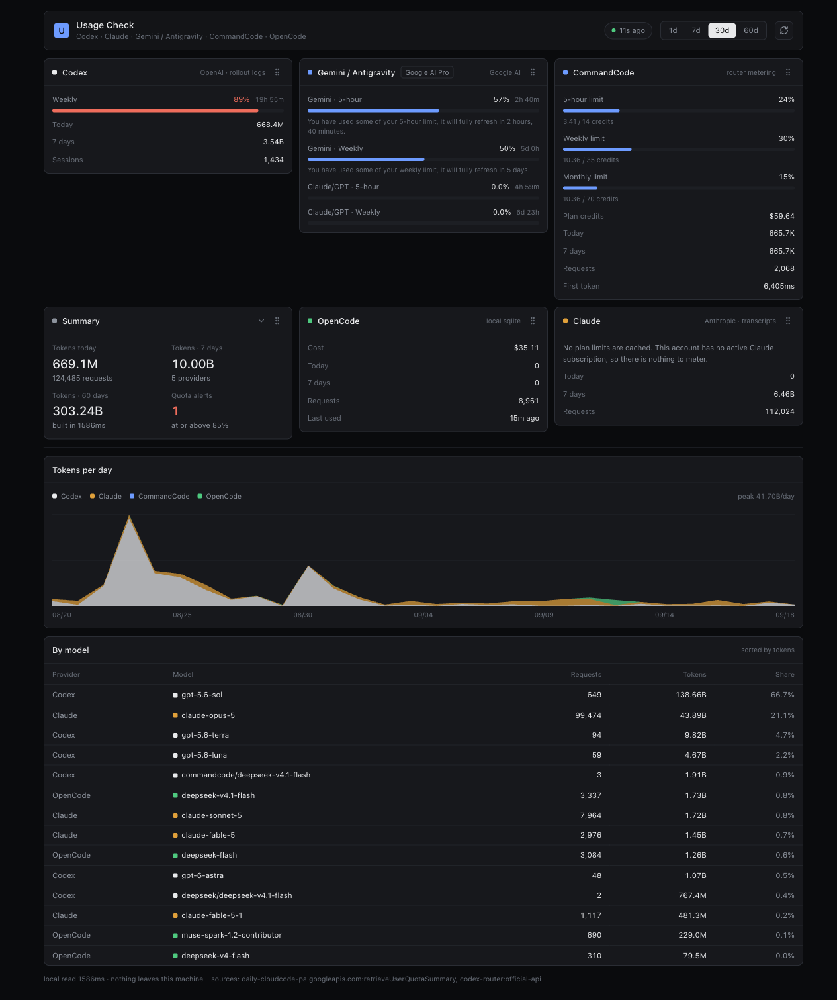
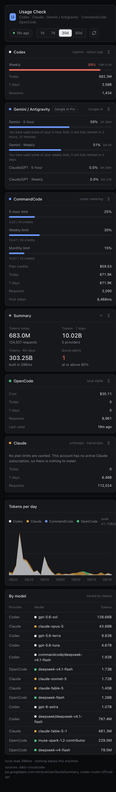

# Usage Check


One local dashboard for the usage and remaining limits of Codex, Claude,
Gemini/Antigravity, CommandCode, and OpenCode.

<p align="center">
  <a href="docs/assets/dashboard.png">
    
  </a><br>
  <sub>Click any screenshot to open it full size.</sub>
</p>

## Why it runs locally

Every number here comes from a credential that belongs to you: OAuth refresh
tokens with cloud-platform scope, billing API keys, provider subscriptions. A
hosted version of this dashboard would need all of them on a server, where one
breach exposes five accounts at once. That trade is not worth a convenience
page, so this tool does the opposite: the collectors run on your machine, and
credentials never leave it.

What that costs:

- Your computer has to be on for the dashboard to be current.
- Setup is more than pasting a URL.

What it buys:

- Nothing to sign up for, no server to trust, no credential in someone else's
  database.
- It reads the same local files your editors already write, at full speed.

Remote access is solved with a private network rather than a public deployment.
See [Viewing from a phone](#viewing-from-a-phone).

## What it reads

| Provider | Source | Gives |
| --- | --- | --- |
| Codex | `~/.codex/sessions/**/*.jsonl` | Tokens, sessions, plan limits |
| Claude | `~/.claude/projects/**/*.jsonl`, `~/.claude.json` | Tokens, requests, plan limits |
| Gemini / Antigravity | `daily-cloudcode-pa.googleapis.com` | Per-group 5-hour and weekly limits, plan |
| CommandCode | `~/.codex/codex-router/usage-events.jsonl`, local billing API | Tokens, credits, request latency |
| OpenCode | `~/.local/share/opencode/opencode.db` | Tokens, measured cost per model |

Provider support is uneven, and the dashboard says so rather than guessing. A
provider with no readable quota shows `unavailable`; a value that may no longer
be current shows `stale`. See [Provider notes](#provider-notes).

## Requirements

- macOS (the service uses `launchd`; the collectors are portable but the service
  setup is not)
- Node.js 22.13 or newer (24.x recommended — OpenCode support needs
  `node:sqlite`, which is not flag-free until 22.13)
- The tools you want to measure, installed and signed in at least once
- [Tailscale](https://tailscale.com), only if you install with `--tailscale` to
  keep the dashboard off the local network

You do not need every provider installed. Missing ones render as unavailable.

## Setup

The fastest path is to hand the repo to a coding agent, because the setup is
mostly "find which credentials this machine already has".

From the repository root, paste this into Claude Code or Codex:

> Install and run this project. It is local-only; do not deploy anything, and do
> not expose it beyond this machine and the Tailscale tailnet. Build it, start
> it, and confirm each provider card shows a real number rather than
> `unavailable`. Then install it as a launchd service so it starts at login, and
> run `tailscale serve --bg 4317` so the tailnet can reach it. If a provider
> reports no data, read that provider's collector in `lib/collectors/` before
> changing code.

Then open <http://localhost:4317>, or the tailnet URL if you set up Serve.

### Doing it by hand

```bash
npm install
npm run snapshot        # prints what each collector found
npm run build
./scripts/install-launchd.sh
```

`npm run snapshot` is the useful step to run first. It shows which providers
produced numbers before any UI is involved, which makes a missing credential
obvious.

The service listens on every interface, so a phone on the same Wi-Fi can open
`http://<machine-name>:4317` straight away. That also means anyone else on that
network can. If you would rather close the local network and reach it over
Tailscale instead:

```bash
./scripts/install-launchd.sh --tailscale   # loopback + `tailscale serve`
```

`--help` lists `--bind`, `--port` and `--label`. Details and the funnel
alternative are in [Viewing from a phone](#viewing-from-a-phone).

## Running as a service

`scripts/install-launchd.sh` generates a LaunchAgent at
`~/Library/LaunchAgents/com.usage-check.dashboard.plist` and loads it. The plist
is generated rather than committed so the Node path matches the machine it runs
on. `--port` and `--label` let you run more than one instance without the two
colliding.

```bash
# restart after a rebuild (the common case)
npm run build && launchctl kickstart -k gui/$(id -u)/com.usage-check.dashboard

# stop / start
launchctl bootout gui/$(id -u)/com.usage-check.dashboard
launchctl bootstrap gui/$(id -u) ~/Library/LaunchAgents/com.usage-check.dashboard.plist

# status and logs
launchctl print gui/$(id -u)/com.usage-check.dashboard | head -8
tail -f ~/Library/Logs/usage-check.log
```

If you have used `systemd`, the mapping is direct: `RunAtLoad` is
`WantedBy=multi-user.target`, `KeepAlive` is `Restart=always`, `ProgramArguments`
is `ExecStart`, and `launchctl print` is `systemctl status`.

Two things worth knowing:

- A LaunchAgent starts at **login**, not at boot. With FileVault enabled macOS
  cannot auto-login, so the service is not up while the machine sits at the
  unlock screen. A LaunchDaemon in `/Library/LaunchDaemons` would start earlier,
  at the cost of running as root.
- `bootout` immediately followed by `bootstrap` can fail with
  `5: Input/output error`. The install script retries; by hand, wait a second
  and run it again.

Idle cost is one Node process at roughly 200 MB RSS and effectively 0% CPU. It
only computes when a browser asks, so leaving the page closed makes it dormant.

## Viewing from a phone

By default the service listens on every interface, so a phone on the same Wi-Fi
opens `http://<machine-name>:4317` with nothing to install. Anyone else on that
network can open it too.

If you want it reachable only from devices you control, install with
`--tailscale`. That binds the service to `127.0.0.1` and publishes it to your
tailnet through [Tailscale Serve](https://tailscale.com/kb/1312/serve):

```bash
./scripts/install-launchd.sh --tailscale
tailscale serve status    # https://<machine>.<tailnet>.ts.net
```

Serve terminates HTTPS on your tailnet and proxies the loopback port, so nothing
on the local network can reach it and the mapping survives reboots. Turning it
off later is `tailscale serve reset`, or reinstall without the flag.

Note that Tailscale Serve has to be enabled once per tailnet, from the link it
prints on first use, which is the part that makes this option more work than the
default.

Use `tailscale funnel` instead if you need access from outside the tailnet. That
publishes the port to the public internet, so put an auth layer in front of it —
a funnel URL is reachable by anyone who has it.

<p align="center">
  <a href="docs/assets/dashboard-mobile.png">
    
  </a>
</p>

## Using it

- **Card order** — drag any card by its grip. The Summary block moves as one
  piece, so it can sit anywhere among the provider cards.
- **Summary** — collapse it to a single line with the chevron.
- **Range** — `1d` / `7d` / `30d` / `60d` controls the per-day chart.
- **Layout is stored per machine, not per browser** — preferences are written to
  `~/.usage-check/prefs.json`, so the desktop and the phone show the same
  arrangement. `localStorage` is only a cache for instant first paint.

## Architecture

```
lib/collectors/    one module per provider, plain ESM, no framework imports
lib/snapshot.mjs   runs the collectors, merges router-sourced quota
lib/prefs.mjs      layout preferences on disk
app/               Next.js App Router; /api/snapshot and /api/prefs
components/        cards, quota bars, chart, table, drag grid
scripts/           install-launchd.sh, snapshot.mjs
```

The collectors are the part worth keeping if you rewrite the UI. They have no
Next.js dependency and can be run directly:

```bash
node scripts/snapshot.mjs --json | jq '.providers[].name'
```

Codex is the reason the collectors read files at all carefully: its session
directory grows past 20 GB, so each file is read with a 64 KB head and a 512 KB
tail instead of a full scan. Adding a naive full pass would turn the dashboard
into a multi-second page.

## Provider notes

These are the things that will look like bugs if you do not know them.

**Codex** rollouts are append-only and get resumed, so a session that started
days ago can still be the file producing today's tokens. Rows are dated by the
last record in the file rather than the session start, and the limits shown are
whatever the newest rollout recorded — your last request, not right now. If you
stop using Codex, that card stops updating.

**Claude** limits are a snapshot Claude Code writes to `~/.claude.json`, not a
live fetch. With no active subscription that snapshot is empty, and the card
says so instead of showing zero.

**Gemini / Antigravity** is the one worth reading about. Google serves the same
quota schema from two hosts, and the production host answers consumer
subscriptions with placeholder buckets that read as "everything full". The
canary host carries real consumption. Measured side by side for the same
account at the same moment, production reported 98.1% weekly remaining where
the app showed 59%. This collector tries the canary host first and only falls
back to production. If your Antigravity card ever shows every bucket at 100%,
that is what happened.

**CommandCode** exposes 5-hour and weekly windows only. The monthly bar the
official app shows is derived here from the credit pool and is labeled as
derived in the UI. Its billing endpoint is undocumented.

**OpenCode** stores a real per-message cost, so its spend figure is measured
rather than estimated. It has no local quota store; the local database is opened
read-only because the WAL file is live.

Each collector in `lib/collectors/` carries the reasoning inline, including the
endpoints that were tried and rejected, so the same dead ends are not
rediscovered.

## Privacy

- No analytics, no telemetry, no outbound calls except the provider quota APIs
  needed to read your own numbers.
- Credentials are read from where your existing tools already store them and are
  never copied elsewhere.
- Conversations, prompts, and file contents are not read. Only usage metadata.
- Nothing is written outside `~/.usage-check/` and the launchd log files.

If you find code that does not match this section, report it privately rather
than in a public issue — see [SECURITY.md](SECURITY.md).

The one thing that looks alarming in the source: an OAuth client id and secret
in `lib/collectors/antigravity.mjs`. Those are Antigravity's own public client
credentials, shipped inside the desktop app and reproduced by every third-party
client that reads its quota. They are not user secrets, and your refresh token
is never stored in this repository.

## License

MIT
